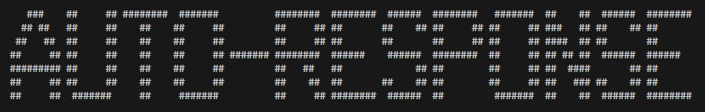

# auto-response

### Кратко

Устал откликаться на авито? Забудь про это! Приложение auto-response будет откликаться за тебя на вакансии, которые тебе нужны!

### Запуск скрипта

1. Открыть терминал в папке проекта
2. Установить зависимости, в терминал - `npm install`
3. Запустить парсер, в терминал - `node index.ts`

